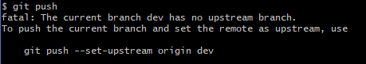

## 一、 博客环境搭建
1、博客基本环境搭建
在会使用git之后，环境搭建的部分还算比较顺利，基本没出现什么大的问题，果然还是多经历就会越来越顺利的，不经历的话就会出现各种各样的奇怪的问题，当经历的多了，就会有自主的能力去规避这些问题，博客的建立主要是参考了[小白独立搭建博客](https://my.oschina.net/ryaneLee/blog/638440)，对作者深表感谢！

2、测试：
这是我的第一篇博客
```C++
#include <stdio.h>
int main(){
	printf("hello world! \n");
	return 0;
}
```
3、博客主题
看到hexo的一个特别好看的主题，名字叫做Even，但是我下载下来之后效果实在不咋的，和Even作者自己做的demo相差甚远，这个简洁的主题的作者也写了一篇关于做hexo主题的[文章](http://www.ahonn.me/2016/12/15/create-a-hexo-theme-from-scratch/)，我实在不奢求自己去做主题，只希望能根据他提供的线索把我的主题做的漂亮一点儿。

## 二、windows下的markdown编辑器
发现了一个markdown编辑器，特别好用，现在使用的就是这款，叫做Yu Writer，这样的话我就可以写静态博客，然后推送到远程了！

## 三、打造属于自己的博客主题
1、landscape的主题参见博客：[教你定制Hexo的landscape打造自己的主题](https://www.jianshu.com/p/b96fd206571a)这儿的代码块部分真的是 太不好看了，主要的明色调的博客背景，突然的一块黑色的代码块，简直反人类
- 另一款叫做hexo-theme-BlueLake的主题[hexo-theme-BlueLake](https://github.com/chaooo/hexo-theme-BlueLake)，这个还比较不错，最主要是作者还添加了我心心念的博客搜索功能，代码块还比较友好，博客如何配置作者也写的比较清楚，详见:[BlueLake博客主题的详细配置](http://chaoo.oschina.io/2016/12/29/BlueLake%E5%8D%9A%E5%AE%A2%E4%B8%BB%E9%A2%98%E7%9A%84%E8%AF%A6%E7%BB%86%E9%85%8D%E7%BD%AE.html#comments)
2、文章的搜索框显示的内容“搜博主文章”，在\Hexo\themes\hexo-theme-BlueLake\layout\_partial\search.jade文件下，可以随意改动;  
3、文章的catagories(分类) tag(标签)BlueLake作者都已经写好，在文章的标题一对“---”包括的部分添加category和tag字段就可以了。
4、加上baidu统计
就按照网上的教程，搜索过之后，然后按照BlueLake作者的提示，顺利添加成功。在网站的最下面的“本站访问总量”可以看到效果。
5、为博客添加评论系统
在为博客添加评论系统的过程中真的是 各种问题
- 一开始按照上面BlueLake主题作者的推荐，首选 网易云跟帖评论，发现他停止服务了。
- 然后选择畅言，发现需要ICP备案号，这github服务器在国外，我也没有备案号，放弃！
- 多说就不用说了，之前我就知道它停止服务了
- 然后研究 来必力，这东西是韩国人做的，确认邮件动不动就给我来一波韩语，我还得谷歌翻译，这个东西倒是好弄，一会就弄好了，但是，网速是真慢啊，慢到压根刷不出来评论框
- 然后外国的不想选，那就选择友言吧，弄半天没什么反应，上网查了下说 不支持https，呵呵
- 最后一个选择，Disqus，也是外国的网站，但是没办法啊，不选择这个，就没有别的可选择了。。。
然后按照官网提示部署好之后，效果还可以，因为github本来就是在国外，总体上的速度比我想象中的快，还不错。

## 四、设置在不同的电脑上面更新博客
这个功能之前我是没想到的。
今天看博客(20180421),突然看到有人讨论这个问题，感觉还挺麻烦的。后来想想，也是！本地的网页的主题什么的其实都没有github上面存放，这样的话如果换台电脑，使用hexo如何生成网页？所以一个好的做法是把hexo相关的文件也上传到github，在需要在别的电脑上面使用的时候，从github上面git clone下来，然后就相当于拥有了hexo合成一个网页需要的各种文件，此时再安装下hexo，具体的操作如下：
本节摘录自:[使用hexo，如果换了电脑怎么更新博客？ - CrazyMilk的回答 - 知乎](https://www.zhihu.com/question/21193762/answer/79109280)

--------------------------------------------------------------------------------------
### **关于搭建的流程**
1. 创建仓库，http://CrazyMilk.github.io；
2. 创建两个分支：master 与 hexo；
3. 设置hexo为默认分支（因为我们只需要手动管理这个分支上的Hexo网站文件）；
4. 使用git clone git@github.com:CrazyMilk/CrazyMilk.github.io.git拷贝仓库；
5. 在本地http://CrazyMilk.github.io文件夹下通过Git bash依次执行npm install hexo、hexo init、npm install 和 npm install hexo-deployer-git（此时当前分支应显示为hexo）;
6. 修改_config.yml中的deploy参数，分支应为master；
7. 依次执行git add .、git commit -m "..."、git push origin hexo提交网站相关的文件；
8. 执行hexo g -d生成网站并部署到GitHub上。
这样一来，在GitHub上的http://CrazyMilk.github.io仓库就有两个分支，一个hexo分支用来存放网站的原始文件，一个master分支用来存放生成的静态网页。完美( •̀ ω •́ )y！

### **日常更新博客**
关于日常的改动流程在本地对博客进行修改（添加新博文、修改样式等等）后，通过下面的流程进行管理。
1. 依次执行git add .、git commit -m "..."、git push origin hexo指令将改动推送到GitHub（此时当前分支应为hexo）；
2. 然后才执行hexo g -d发布网站到master分支上。
虽然两个过程顺序调转一般不会有问题，不过逻辑上这样的顺序是绝对没问题的（例如突然死机要重装了，悲催....的情况，调转顺序就有问题了）。

### **在别的电脑上面更新博客**
本地资料丢失后的流程当重装电脑之后，或者想在其他电脑上修改博客，可以使用下列步骤：
1. 使用git clone git@github.com:CrazyMilk/CrazyMilk.github.io.git拷贝仓库（默认分支为hexo）；
2. 在本地新拷贝的http://CrazyMilk.github.io文件夹下通过Git bash依次执行下列指令：npm install hexo、npm install、npm install hexo-deployer-git（记得，不需要hexo init这条指令）。

---------------------------------------------------------------------------------
我基本上是参照上面的思想，但是鉴于我本地是已经做好了两篇博客，我采取了相反的方法。
- 首先，把本地的road037019.github.io目录做成了一个本地仓库，然后通过git的分支命令将本地仓库上传到github，这样本地的master分支对应于远程的master分支。
- 然后，在本地建立hexo分支，然后把这个分支也上传到github，只不过这个上传的命令和只有一个master分支的命令不同，按照提示做就行：

图片中的意思是说当前分支没有上游分支，可以用过提示的命令来创建上游分支并且将当前分支push到新创建的上游分支；

通过上面的两部操作就在本地和github两端都创建了两个分支：master和hexo，由于hexo的_config.yml文件中已经设置了将本地的博客上传到master分支，那么和网站的主题等和网站本身相关的文件我们就上传到hexo分支（但是，主题又不是我写的，我基本不对主题做什么大的改动），但是，需要记住的一点就是，当对网站本身进行改动时，记得切换到hexo分支，然后push到github，这样的话当我们在一台新电脑上面操作时，可以先将hexo分支的内容通过git pull origin hexo命令拉倒本地，


## 由于我本地安装了福昕阅读器，占用了本地的4000端口，导致我在本地生成博客以后，在本地使用local:4000无法查看，看了下可以通过修改端口号来解决，端口号所在的文件是：Hexo/node_modules/hexo-server/index.js

##  git操作允许你本地有的东西远程没有，但是不允许远程有的东西你本地没有，如果远程有你本地没有的话，会报错，并且提示你git merge；


